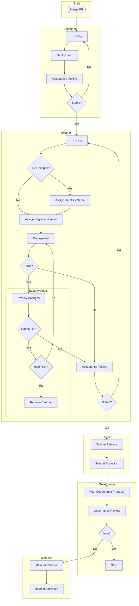

# Release Process

## Principles

We've had our share of headaches with protocol upgrades: rushed deployments, late-stage bug discoveries, and features
piling up while waiting for the next release window. These principles fix those problems by changing how we think about
releases.

### The Train Leaves on Schedule

Like a train system, protocol upgrades run on a schedule instead of waiting for specific features to be ready or a
predetermined scope to me met.

- No more waiting 3-4 months between hard forks
- Teams don't need to rush features to "catch" an upgrade
- Everyone knows when the next release is coming
- We have the opportunity to find integration bugs earlier
- Missing a train isn't a big deal - there's always another one coming

As part of this, rather than committing to releases in advance we instead ask ourselves "what features are ready to
ship?" whenever a train leaves the station.

### Test in Isolation, Ship as a Set

Every feature has to prove itself on its own before we combine it with others.

- Each feature needs to prove itself before joining an upgrade
- We find bugs early instead of all at once at the end
- No surprises when features are combined
- Nothing makes it into an upgrade until we know it works

## Process

See the below diagram for an overview of the release process. The rest of this document will follow the process to
ship an individual feature to mainnet.

Deployment Flowchart

### Alphanet

The Alphanet is the initial integration environment for protocol upgrades. Its primary purpose is to validate
that new features work correctly on a deployed network running real infrastructure before moving on to broader
integration and upgrade testing.

The Alphanet can contain any combination of L1 and L2 upgrades. It is entirely acceptable to have an Alphanet with
only L1 upgrades, and vice versa. By decoupling these two types of upgrades, we can increase our throughput and
deployment flexibility.

**Network Overview**

- Deployed once a month
- Scope is decided during the upgrade planning meeting
- Features must be code-complete to be included
- The network resets completely with each deployment
- All upgrades are active at genesis

**Deployment Process**

1. Confirm your feature is ready for deployment
2. Submit your feature for inclusion in advance of the upgrade planning meeting
3. Follow the process described [here](https://github.com/ethereum-optimism/devnets) to schedule your feature for
   inclusion in the next Alphanet
4. Once deployed, validate your feature works as expected

Features that miss a deployment window or need additional work can target the next monthly deployment.

### Betanet

The Betanet validates a complete upgrade that will be deployed to a production networks. Unlike the Alphanet, the
Betanet performs the actual upgrade process
and confirms that all features work together as intended.

Betanets are deployed on an ad-hoc basis whenever there are enough features that have passed the Alphanet. We meet
monthly to determine if this is the case. If we decide to deploy a Betanet, then all the features in its scope are
bundled together in a numbered upgrade. The upgrade number corresponds to the number of the governance proposal that
will authorize them on mainnet.

While we meet every month to determine the Betanet's scope, there is no obligation to actually deploy a Betanet every
month like there is with an Alphanet.

Betanets will be redeployed in the event of a critical issue or if a feature needs to be removed.

**Network Overview**

- Deployed at most once a month when enough Alphanet features are ready
- Tests actual upgrade transactions and hardfork mechanics
- Where security audits are performed
- May require multiple iterations if issues are found
- Serves as the final testing ground before testnet deployment

**Deployment Process**

1. Confirm your feature is ready for deployment, and has been deployed to an Alphanet
2. Submit your feature for inclusion in the next Betanet by adding it to the upgrade planning meeting's agenda
3. If there are enough features to constitute a Betanet, the Betanet will be assigned an upgrade number
4. If your feature includes an L2 hardfork, it will be assigned a hardfork name
5. Follow the process described [here](https://github.com/ethereum-optimism/devnets) to schedule your feature for
   inclusion in the next Alphanet
6. Once deployed, validate your feature works as expected

Features that miss a deployment window or need additional work will need to target the next Betanet.

### Testnet

The Sepolia Testnet is the first public deployment of protocol upgrades. This allows ecosystem partners to test the
upgrades in a stable environment and runs in parallel with the governance process. Unlike Alphanet and Betanet, testnet
changes directly impact external users and applications.

**Network Overview**

- Release must cut 2-3 weeks before activation
- Deploys to all chains in the Sepolia superchain
- Runs parallel to the governance proposal
- Provides stable testing environment for ecosystem
- Matches mainnet configuration and parameters
- All audits must be complete prior to entering testnet

**Deployment Process**

1. Confirm that the betanet has successfully concluded without incident, and that all acceptance tests have passed.
2. Ensure that testnet activation is part of the next upgrade planning meeting's agenda
3. Follow up with members of the Protocol team to ensure that the testnet is ready for deployment

### Governance

In parallel with testnet deployment, we will initiate the governance process to authorize the upgrade on mainnet.
This process is covered in more detail in the [SDLC](./sdlc.md).

### Mainnet

The final step in the process is the mainnet deployment. Follow up with the Protocol team to ensure that the
mainnet release version is cut. Determine the mainnet activation date in the upgrade planning meetings.