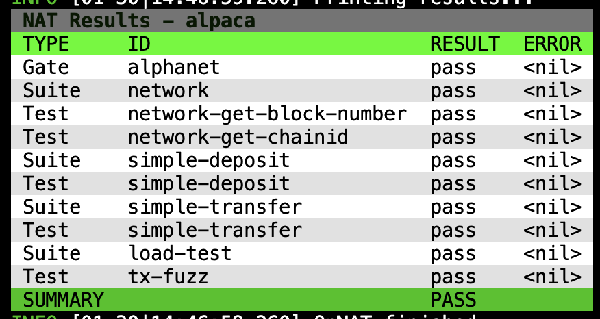

# Acceptance Testing

Acceptance testing is a prerequisite for networks to promote from Alphanet, to Betanet, to Testnet. This is a shared 
responsibility between the Platforms and the feature teams:

| What Is It                                   | Who Does It    |
|----------------------------------------------|----------------|
| Maintains acceptance testing tooling         | Platforms Team |
| Writes acceptance test for network liveness  | Platforms Team |
| Runs acceptance tests                        | Platforms Team |
| Writes acceptance test for specific features | Feature Team   |
| Performs upgrades                            | Feature Team   |

The Platforms team is responsible for running acceptance tests against each network. To coordinate your feature's 
acceptance testing, contact **Stefano** or **Jacob** on Discord.

## Tooling

The acceptance tests themselves are written in Go
using [op-nat](https://github.com/ethereum-optimism/infra/tree/main/op-nat), which provides a high-level framework
for developing acceptance tests.

    

New acceptance tests are added to the `op-nat` framework as needed. See the
[README](https://github.com/ethereum-optimism/infra/blob/main/op-nat/README.md) for instructions on how to do this.