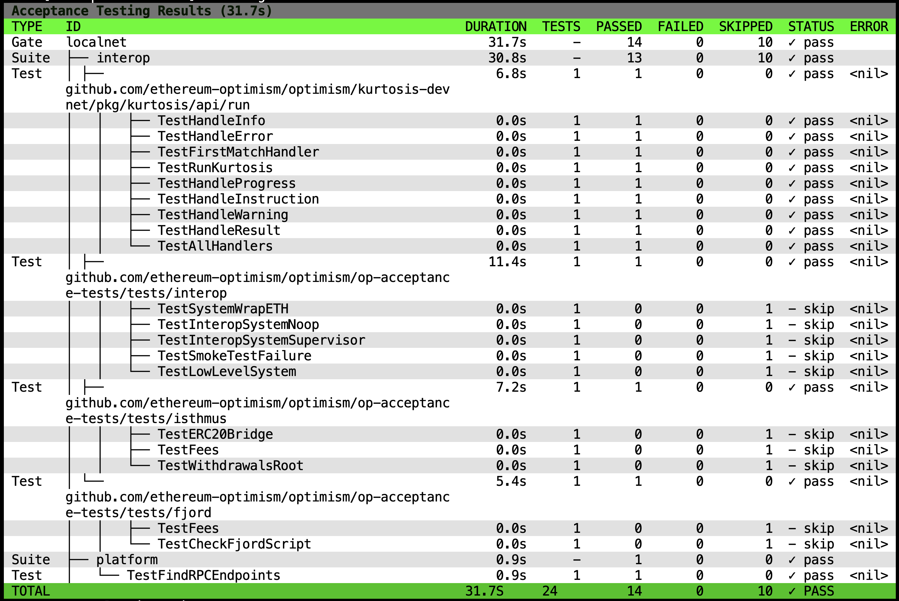

# Acceptance Testing

Acceptance testing ensures OP Stack networks are feature-complete, reliable, and contain features which are ready for promotion.

The Platforms team will compile a Release Readiness Process (RRP) document, which will outline how to acceptance test devnets. This will include a list of tests to run - the Release Readiness Checklist (RRC). They will originally be run manually, but we'll automate them over time.

By automating validation and enforcing quality gates, we reduce risk and increase confidence in releases. Much of this is facilitated by a new tool, op-acceptor, which can run standard Go tests against OP Stack networks and track that network’s readiness for promotion. Acceptance testing is a prerequisite for networks to promote from Alphanet, to Betanet, to Testnet.

This is a shared responsibility between the Platforms and the feature teams:

| What Is It                                   | Who Does It    |
|----------------------------------------------|----------------|
| Maintains acceptance testing tooling         | Platforms Team |
| Writes acceptance test for network liveness  | Platforms Team |
| Runs acceptance tests                        | Platforms Team |
| Writes acceptance test for specific features | Feature Team   |
| Performs upgrades                            | Feature Team   |

The Platforms team is responsible for running acceptance tests against each network. To coordinate your feature's 
acceptance testing, contact **Stefano** (_stefano_), **Platforms Protocol DevX Pod** (@Protocol DevX Pod) or **Platforms Team** (@Platforms Team) on Discord.

## Tooling

The acceptance tests themselves are written in Go and are run by **op-acceptor** within the [op-acceptance-tests](https://github.com/ethereum-optimism/optimism/tree/develop/op-acceptance-tests) directory of the optimism monorepo.
[op-acceptor](https://github.com/ethereum-optimism/infra/tree/main/op-acceptor) provides a high-level framework for registering, running and viewing the results of acceptance tests.

    

## Tests
To add new acceptance tests see the [README](https://github.com/ethereum-optimism/optimism/blob/develop/op-acceptance-tests/README.md#adding-new-tests) for instructions on how to do this.
