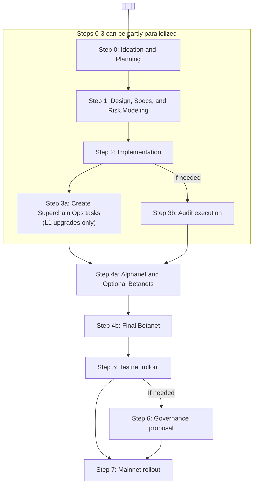

# Software Development Lifecycle (SDLC)

This document describes our Software Development Lifecycle (SDLC), which is how we ship software to production.

It provides guidance, and is not prescriptive—not every step will be relevant to every project.
This is because not all projects are equally security-critical, and therefore not all projects should be treated equally.
When in doubt about what's needed to ship your project, ask your manager.
If you deviate, note the deviation and rationale somewhere that isn't Slack (e.g. a design doc, github issue, etc.)

---

> [!IMPORTANT] Guiding Principle: Always Be Release Ready
>
> - At any time, the latest `develop` should be shippable via our deployment pipeline. Build confidence in correctness and security continually throughout the development lifecycle, not only at the end.
> - Build in vertical slices: split fixes or features into end-to-end increments that can ship independently.
> - Separate feature deployment from activation using feature flags.

---

## Process

### Step 0: Ideation and Planning

Make sure you know, and document, the answers to:

- What is the problem we need to solve?
- What requirements and constraints do we have?
- Who exactly is the customer?

### Step 1: Design, Specs, and Risk Modeling

#### Design Doc

Now that the problem, requirements, and customers are known, create a design doc that describes the solution:

1. Create a design doc PR in [`design-docs`](https://github.com/ethereum-optimism/design-docs) or [`design-docs-private`](https://github.com/ethereum-optimism/design-docs-private) (using the templates in those repos).
2. Share this with customers and design partners to get feedback. Iterate on the design doc until customers are happy with it.
3. Announce the design doc PR in [#protocol-general](https://discord.com/channels/1244729134312198194/1244731030301048874). Tag managers from impacted teams so they can choose a representative from their team to review the design doc:
    1. **Product:** Sam McIngvale
    2. **DevRel:** Matthew Cruz (soyboy)
    3. **Ecosystem:** Faina Shalts
    4. **Protocol:** Matt Slipper
    5. **Proofs:** Paul Dowman
    6. **Platforms:** Alfonso Munoz de Laborde
    7. **EVM Safety:** Matt Solomon
    8. **Developer Advisory Board (DAB):** Wildmolasses (Ed) via #ext-dab Slack channel
4. Schedule a design review, include the team representatives and any other stakeholders/customers on the invite.

#### Specs

Once the design is finalized, if it modifies smart contracts, consensus, or protocol functionality, write/update specs in the [`specs`](https://github.com/ethereum-optimism/specs) repo.
Good specs will clearly document assumptions and invariants, see the [AnchorStateRegistry specs](https://specs.optimism.io/fault-proof/stage-one/anchor-state-registry.html) as an example of well-written specs.

#### Determine governance impact

As you develop a design for your change, you’ll need to determine if the change requires a regular governance process or a maintenance upgrade process.
Changes that affect consensus, touch smart contracts on L1, modify predeploys, or impact transaction ordering will generally require a regular governance process.
If you’re unsure, consult Ben Jones.

For full criteria and examples for determining if governance is needed, refer to the [Governance Criteria](./governance-criteria.md) and the [Law of Chains](https://github.com/ethereum-optimism/OPerating-manual/blob/main/Law%20of%20Chains.md) user protections.

#### Risk Modeling

This will typically, but not always, be in the form of threat modeling.
Reach out to the EVM Safety team for guidance or training on threat modeling.

Your initial threat model will inform engineering planning by helping answer the questions of what tests are needed,
what edge cases to cover, what new or updated monitors are needed, what runbooks need to be written or modified, and audit needs.
For more info on determining audit needs, see our [audit framework](https://gov.optimism.io/t/op-labs-audit-framework-when-to-get-external-security-review-and-how-to-prepare-for-it/6864) and [`audits.md`](./audits.md).

Once the initial threat modeling is done, extract all answers into issues (or wherever you are tracking project tasks) for tracking purposes.

Be sure to revisit and update your threat model as the project evolves, and as mitigations are implemented.

### Step 2: Implementation

At this stage, you can start writing your code. Make sure you follow these standards:

- All consensus code must be behind a feature flag, decoupled from the hardfork name (see <https://github.com/ethereum-optimism/design-docs/blob/main/protocol/decoupled-features.md>).
- All changes must go through code review, and have test automation. Use coverage tooling and reports to identify testing gaps.
- For new features, add [acceptance tests](./acceptance-testing/index.md).
- For smart contracts the specs must clearly define assumptions and invariants as described [above](#specs), and you must have ~100% test coverage.
- Include any changes to [OPCM](https://devdocs.optimism.io/contracts-bedrock/contributing/opcm.html) and VerifyOPCM.
- Make sure to give access to and tag @wildmolasses (Ed) from the Developer Advisory Board in any (draft) specs.

### Step 3a: Create Superchain Ops tasks (L1 upgrades only)

If your change modifies L1 smart contracts, you’ll need a `superchain-ops` playbook to execute the multisig transactions.

This is typically handled by DevRel and EVM Safety teams.

> [!WARNING] Ensure that the tasks are _merged_ before executing them.
> This ensures any simulations that run in CI take account of all changes that are being prepared holistically.
> Failure to do this can result in tasks which pass simulations during preparation but which ultimately fail during execution.

### Step 3b: Audit execution

- See [`audits.md`](./audits.md) for more information on how to get approval for and execute an audit.
- Make sure to leave sufficient leave time for scheduling the audit.
- Only start the audit once code, specs, and tests are complete.
- The audit must be completed, with fixes implemented, before Sepolia rollout.
- If there are high severity issues, do NOT proceed to the next step after fixing them—instead, perform a retro to see how those issues got in, and what else may have been missed as a result.

### Step 3c: Draft Governance proposal

- Once code and specs are complete, the governance proposal should be drafted and shared with the Developer Advisory Board (tag @wildmolasses (Ed) in the #ext-dab Slack channel
- This first draft of the governance proposal may be shared as a notion or google doc, and at this stage does not need to include elements like the absolute prestate hash, transaction payloads etc.
- It should all other information mentioned the [governance proposal template](https://github.com/ethereum-optimism/OPerating-manual/blob/main/Protocol%20Upgrade%20Template.md) like the specs, motivation and technical documentation
- This allows the Developer Advisory Board to pre-read the proposal before its publication, and provide early feedback.

### Step 4: Alphanet/Betanet devnet rollout

> [!WARNING] Prerequisites for the final betanet
> All of the steps above MUST be completed before the final betanet. That includes:
>
> - Specs
> - Completion of risk modeling
> - Implementation of mitigations identified by risk modeling (tests, monitors, runbooks, etc.)
> - Governance impact analysis and draft proposal
> - Audit execution and required fixes

Next, it’s time to roll out to the Alphanet, then the Betanet. See the [release process](release-process.md) and [acceptance testing](acceptance-testing/index.md) docs for more details.

You may deploy to multiple betanets if needed, for example to rehearse an upgrade process, but the final betanet must have no known issues and must result in no new issues being discovered.

### Step 4a: Publish Governance proposal

> [!IMPORTANT]
> Final betanet testing must be complete before the governance proposal is published.
> There should be _full_ confidence in the on-chain and off-chain code, including any activation timestamps, absolute prestate hash and contract deployment addresses.
> Governance posts should not be published optimistically in an attempt to save time by running betanet testing in parallel.

- Once the absolute prestate hash, Monorepo Commit Hash, OPCM version, L1 transaction payload are known, they should be added to the draft governance proposal
- At this point, the DAB should have reviewed the draft and provided feedback
- Obtain Foundation and Legal approval
    - Loop in Ben Jones, Julian Wahl and Bobby Dresser from the Foundation
    - Loop in Eric Van Wart from legal
- Post the proposal on the governance forum
    - Let the DAB lead (wildmolasses (Ed) know via Slack)
- Once published to the forum, the approval and veto periods begin, and take approximately 14 days to complete for non-maintenance upgrades, and 7 days for maintenance upgrades

The Sepolia rollout can happen in parallel.

### Step 5: Sepolia rollout

Sepolia is a production network, therefore has the same standards and security requirements as mainnet.
This is why the betanet in the prior step must have no known issues and must result in no new issues being discovered.

Coordinate with DevRel and external partners that may be affected.
Sepolia must match mainnet as much as possible, including for partner configurations.

### Step 7: Mainnet rollout

1. Remove the `rc` suffixes from your releases.
2. Schedule the mainnet upgrade after the veto period expires.
3. Coordinate with EVM Safety to schedule the mainnet multisig upgrade.
4. The Product/Dev/PMO Leads to go through their checklist to ensure all stakeholder needs, documentation, and communications are in place. This includes working with Marketing, DevRel, Data, Finance, Foundation, etc.
5. Monitor post-release with on-call coverage, then collect customer feedback on the overall process and track it for future process improvements.
