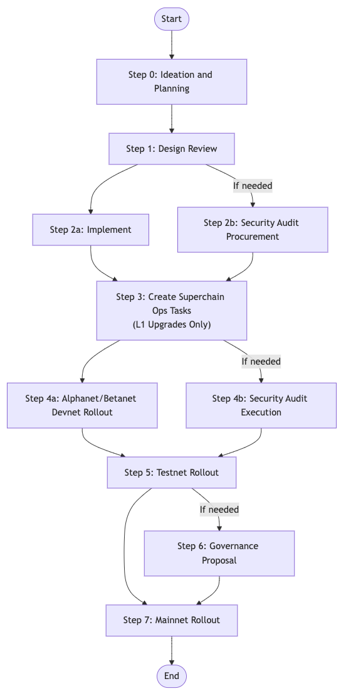

# Engineering SDLC v1.0

# Overview

This document describes our Software Development Lifecycle (SDLC). Put simply, it walks you through how we ship software.

# Using This Guide

Treat this guide like a flowchart. Not every step will be relevant to every project.

# SDLC

## Step 0: Ideation and Planning

While beyond the scope of this document, it’s imperative that you know what you’re building and why before development starts. Work with your Product and Engineering Managers if you’re unsure about what you’re building. Typically, there’s a PRD or Problem/Proposed Solution doc that describes the business rationale for our major projects.

1. Start a cross functional discussion with Product, Engineering, DevRel, and PMO to align on the a preliminary scope of work or hypothesis of the work that needs to be delivered. 
2. Typical outputs during Ideation & Planning in which the team builds together:
    1. A PRD or some form of documentation that elaborates on requirements
        1. Acceptance criteria and definition of done 
            1. Spike and/or Prototyping: Help elaborate on the requirements to have a better idea on scope/resource/complexity of the solution
        2. Resourcing & Capacity Planning - Do we have the right people to accomplish the work?
        3. Identify risks and dependencies, and achieve alignment/buy-in
3. Other outputs from this phase that will accelerate the subsequent steps:
    1. Program Dashboard in GitHub
    2. Sequencing and timeline 
    3. Communication Plan (Slack, Discord, Meetings)

## Step 1: Design Review

Changes that affect multiple teams, deviate from existing practices, introduce new technologies, or change the protocol need to go through Design Review. The goal is to achieve alignment between engineering teams, document what is known about the project at this stage, and keep the bar for technical rigor high. 

It works like this:

1. Create a design doc and post it as a PR in either the [`design-docs`](https://github.com/ethereum-optimism/design-docs) or [`design-docs-private`](https://github.com/ethereum-optimism/design-docs-private) repositories. Use the templates in the repositories.
2. Loop in the leads of each team that might be impacted by your change. Please be especially cognizant of any downstream impact of your proposed changes and loop in those leads as well. These leads are:
    1. **Product:** @Sam McIngvale
    2. **Ecosystem:** @Faina Shalts or @Hamdi Allam
    3. **DevRel:** @Matthew Cruz (soyboy)
    4. **Protocol:** @Mark Tyneway or @Proto 
    5. **Proofs:** @Paul Dowman or @Adrian Sutton
    6. **Infrastructure:** @Zach Howard or @Alfonso Munoz de Laborde 
    7. **EVM Safety:** @Kelvin Fichter or @Matt Solomon 
    8. **Cloud Security:** @Raffaele Mazzitelli or @Alfonso Munoz de Laborde
3. Announce the PR in the [#pm](https://discord.com/channels/1244729134312198194/1244729134848938033) channel on Discord. Make sure to tag the required domain reviewers to allow for asynchronous review. Leads may tag in additional people as necessary.
4. Complete the specs, risk modelling, and governance impact analysis substeps as detailed in the subsections below.
5. Schedule a synchronous design review meeting to ratify the design doc and merge the PR. “Ratified” in this case means there’s no more blocking feedback on the design, and merging it into the main branch of the design docs repo. It’s up to the design doc’s author to decide when this is. If your design doc doesn’t get consensus, close the PR instead. **The goal of the discussion is to move towards closure, where closure is either ratifying or rejecting the design doc under review.** Don’t leave a design review hanging without clear actions to move it towards either ratification or rejection.

Keep in mind that the more complex your design is, the longer it will take to review. Use the following SLA as a rule of thumb for how much time to give your reviewers:

- Short document (e.g., 1-pager): share a minimum of 2 working days prior
- Medium-length document (2-5 pages): share a minimum of 3-5 working days prior
- Long document (6+ pages): share at least 1 week prior

For more information about the design review process, see [this doc](https://docs.google.com/document/d/1AvPZMUK5aQjdpw8xAFLkQ7d5sYTgaajkG1IEqgXRcu0/edit?tab=t.0).

### Write Specs

Changes that modify smart contracts, consensus, or could otherwise be incorporated into alternative client implementations need to be specified in the [`specs`](https://github.com/ethereum-optimism/specs) repo before being rolled out. This is started during the design review, and regularly updated in parallel with writing the implementation, since we often find ways to improve the spec while writing the code.

Write your spec by creating a PR against the specs repo and requesting review from one of the specs reviewers identified during the design review. **Loop in the same set of leads as you would for the design doc to review the spec.** They can assign reviewers based on who has the most knowledge of the area of the spec being modified.

### Determine Governance Impact

As you develop a design for your change, you’ll need to determine if the change requires governance. Changes that affect consensus, touch smart contracts on L1, modify predeploys, or impact transaction ordering will generally require governance approval. If you’re unsure, consult @Ben Jones.

**If YES (Governance Needed):**

- Follow the governance path below. The risks must be fully detailed in the risk modelling. Writing a governance proposal will be required.

**If NO (Governance Not Needed):**

- Implement and test, then ship to testnet and mainnet following our rollout procedures. You still need to execute risk modelling normally.

The detailed criteria for what does/does not require governance is described below.

#### Detailed Governance Criteria

<aside>
⚠️ All upgrades which require the Security Council to take action require a governance vote, if they are not an emergency bugfix.
</aside>

The threshold for which changes require a governance vote is based on the User Protections clause of the Law of Chains. In summary, these protections are:

1. **State Transition and Messaging Validity:** OP Chain state transitions or cross-chain messages sent to or from OP Chains must follow the rules of the latest governance-approved release of the OP Stack. This means that changes to the block derivation function or messenger contracts are always subject to a governance vote.
2. **Security, Uptime, and Liveness:** Block production, sequencing, and bridging must satisfy uniform standards for security, uptime, and liveness across all OP Chains. This means that  changes that could cause users to be unable to transact (e.g., changing the gas limit to something untenable) are subject to a governance vote.
3. **Universal, Governance-Approved Upgrades:** OP Chains must upgrade together under OP Stack releases that are approved by governance. Any upgrades that aren’t backwards compatible are therefore subject to a governance vote.

Using this framework, we can define the following rough upgrade types and whether or not each upgrade type needs a governance vote. If you are uncertain if an upgrade requires governance approval, please request delegate feedback on the forum. 

- **Consensus Changes**
    
    **Vote required:** Yes
    
    Consensus changes modify the state transition function or messaging validity. As such, they must be approved by governance to satisfy protection one above. 
    
    For example:
    
    - Bedrock
    - EIP-4844
    - Shanghai
    - Any L1 upgrade that modifies a contract under the control of the Security Council. The Security Council cannot make any changes to L1 unless they are approved by governance *or* the result of an active or impending security issue.
- **Predeploy Updates**
    
    **Vote required:** Yes
    
    Predeploy updates must be approved by governance in order to satisfy protection three above. More specifically, changes to predeploys must be rolled out across all OP Chains in order to prevent functionality on one chain from diverging from all the others.
    
- **Cross-Chain Contracts**
    
    **Vote required:** No
    
    “Cross-chain contracts” refers to smart contracts like Gnosis SAFE or `create2deployer` which are deployed at the same address across multiple chains. These contracts do not require a governance vote because anyone can deploy them at any time on any chain. This is true even if we decide to add these contracts to the genesis state, since someone could always deploy them after the chain comes online.
    
    Note that any changes to the `0x42...` namespace *do* need to go through governance, as do any contract deployments that require irregular state transitions.
    
- **Parameter Updates**
    
    **Vote required:** Change Dependent
    
    Parameter updates that impact protections one or two above will need to be approved by governance. For example, setting the gas limit or changing the EIP-1559 parameters will require governance approval since modifying these parameters can prevent users from transacting.
    
    Examples:
    
    - Updating the ProxyAdmin/challenger/guardian addresses requires a governance vote.
    - Updating gas parameters require a governance vote until they’re explicitly configurable by the Chain Governor
    - Updating the batcher/proposer addresses (among addresses already on the allowlist) do not require a governance vote as long as they are within the set of governance-approved addresses
- **Non-Consensus Client Features**
    
    **Vote required:** No
    
    Network-wide features introduce functionality that may require coordination with alt-client developers, but without risk of a chain split. As such these changes satisfy all three user protections above as long as they are backwards-compatible and meet our bar for engineering rigor.
    
    Examples:
    
    - Snap sync
- **Changes Affecting Transaction Inclusion/Ordering**
    
    **Vote required:** Yes
    
    Even though the mempool is technically not part of consensus, it affects the way in which transactions get included into the chain and can negatively effect user experience. As a result, unilateral changes that affect transaction ordering violate protection two above and therefore need a vote. If the community detects that nonstandard ordering software is being run, it is grounds for removal from the sequencer allowlist.
    
    Examples:
    
    - Moving to a public mempool
    - Running custom PBS/transaction pool software
- **Non-Consensus, No-Coordination, Non-Ordering Changes**
    
    **Vote required:** No
    
    These changes are a catch-all for any change that doesn’t modify consensus or require coordination. These changes can be rolled out unilaterally without input from governance since they do not impact any of the protections described above.
    

*Note: The above sets are not always mutually exclusive. If a given change might fall into multiple buckets, if any one of them requires a vote, then the change requires a vote. If you are unsure if something requires a governance vote, ask @Bobby Dresser or @Ben Jones.*

### Risk Modelling

Engineering owns architecture decisions, and Risk Modelling is the primary way in which it identifies possible risks in the launch and their mitigations. Risk modelling works best when it is started early in the development process, and updated as work progresses and more is known about the project.

Risk modelling is always required. In its first iteration, it will identify the risk level of the project. For projects on the higher half of the risk spectrum, a second iteration must provide full detail of the risks and suggested mitigations.

Product must always be consulted when designing risk mitigations, as they can substantially alter the end product.

Risk modelling will be reviewed by Security before the design documentation is merged. For higher risk projects, Security will require that the risks are exhaustive, their mitigations are acceptable, and overall the risk tolerance is consistent across all projects within the collective.

The security team signs off on the risk modelling, or provides feedback to engineering on how they can achieve that sign-off. The risk modelling author is responsible for program managing and driving the risk modelling process to completion and Engineering needs to factor in the timeline for its Security review as part of our estimates.

It is acknowledged that not everything is known about the project when risk modelling is done in the design step. Still, it is expected that the knowledge present at that stage is enough to accurately obtain a rough risk classification, and to identify a proportion of the existing risks and their mitigations.

The risk modelling will [determine the level of auditing](./audits.md) required for releasing the feature. Follow the linked process to procure and execute the audit.

The risk modelling might have as an outcome one or more mitigation actions. These actions should be executed during implementation and are reviewed by security, with one security person dedicated per project (throughout the project). Until the feature is released onto mainnet, teams can introduce new or updated failure modes into the risk modelling. Those updates and corresponding mitigation actions are also reviewed by security.

**Updated Risk Modelling with executed mitigation actions is required prior to devnet deployments.**

We currently use FMAs as our risk modelling framework, but project teams are encouraged to use other risk modelling frameworks if they are more appropriate and EVM Safety verifies that they provide a similar level of detail.

To write an FMA, follow the [FMA process](./fmas.md). More details from the [Security <> Developer Interface](https://www.notion.so/Security-Developer-Interface-232f2c43e8474a2a90e07d3cbe0b33bc?pvs=21):

## Step 2: Implement

At this stage, you can start writing your code. Make sure you follow these standards:

- All consensus code must be behind a hardfork feature flag.
- All changes must go through code review, and have test automation. Use CodeCov to determine how much of your code is tested, and to identify testing gaps.
- All smart contract changes must meet the following minimum standards:
    - Follow the UX and Safety guidelines described [here](https://github.com/ethereum-optimism/design-docs/pull/177).
    - When upgrading existing contracts, follow the spec [here](https://github.com/ethereum-optimism/design-docs/blob/main/protocol/l1-upgrades.md).
    - Have near 100% test coverage along with invariant tests.
    - When useful, changes should be formally verified with Kontrol.
- All actions resulting from the FMA must be completed during implementation and will be reviewed by EVM Safety before the code can be deployed to a devnet.

## Step 2b: Security Audit Procurement (If Needed)

The risk modelling results will be used to determine the audit requirements for the change. The [process to procure and execute an audit](./audits.md) should be started in parallel with the implementation if it is needed.

You should factor the amount of time required for both the audit as well as and necessary fix review into delivery timelines.

## Step 3: Create Superchain Ops Tasks (L1 Upgrades Only)

<aside>
⚠️

This section is under construction. Contact @Matt Solomon for questions regarding Superchain Ops tasks.

</aside>

If your change modifies L1 smart contracts, you’ll need a `superchain-ops` playbook to execute the multisig transactions with the Security Council.

## Step 3b: Audit Execution

Once the code is completed, the [audit can be executed](./audits.md). The Tech Lead can decide to delay the execution of the audit if they have reasons to think it will be more efficient to do so, but it must be completed before the testnet rollout can begin.

## Step 4: Alphanet/Betanet Devnet Rollout

**All the steps initiated in the design step must be completed before the devnet rollout can begin. That includes specs, risk modelling, and governance impact analysis.**

Next, it’s time to roll out to the Alphanet, then the Betanet. See the [release process](release-process.md) for 
more details.

## Step 5: Testnet Rollout

**If an audit is required, it must be completed including fixes and fix review before the testnet rollout can begin.**

Next, it’s time to roll out to the official testnet. These networks upgrade multiple chains at once, so they require coordination with DevRel and external partners. These networks are also considered production, so a high degree of stability is expected. 

Testnets should be kept in sync with Mainnet as much as possible, including maintaing the same ownership structure, contract versions and upgrade paths. Therefore upgrading a testnet should not be done until there is a 
high degree of confidence that the same upgrade will be deployed to Mainnet.

The process to upgrade these networks is:

1. (As Applicable) Update the Superchain Registry with an updated hardfork time.
2. (As Applicable) Update OPCM/op-deployer to upgrade smart contracts.
3. Cut an `rc` build like you would normally.
4. Loop in @Matthew Cruz to schedule your upgrade. Typically partners need at least a week of notice.
5. Use `op-workbench` to deploy onto our infrastructure.
6. Use `op-deployer` to upgrade L1 smart contracts.

*Note: The governance proposal is not necessarily blocked by the testnet upgrade. However the Mainnet upgrade should not be executed until at least one week has passed since the testnet upgrade.*

## Step 6: Governance Proposal (If Governance Is Needed)

1. **Prepare Proposal:**
    - Reference a stable commit/tag.
    - Include risk modelling results, audits, testnet performance, and activation schedule.
    - Use the standard governance [template](https://gov.optimism.io/t/season-6-charter-aware-upgrade-proposal-template/8134).
2. **Review & Post:**
    - Obtain Foundation (FND) and Legal approval.
        - Loop in @Ben Jones and @Bobby Dresser from the FND.
        - Loop in @Trevor Dodge and @Eric Van Wart from legal.
    - Post the proposal on governance forums.
    - Loop in @Lavande to coordinate delegate approval.
3. **Approval & Veto:**
    - Wait for the vote and veto period to complete.

## Step 7: Mainnet Rollout

1. Remove the `rc` suffixes from your releases.
2. Schedule the mainnet upgrade after the veto period expires.
3. Coordinate with @Maurelian or @Blaine Malone to schedule the mainnet multisig upgrade.
4. The Product/Dev/PMO Leads to go through their checklist to insure all stakeholder needs, documentation, and communications are in place. This includes working with Marketing, DevRel, Data, Finance, Foundation, etc.
